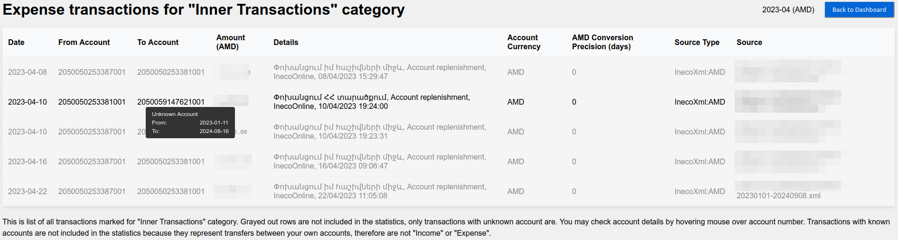
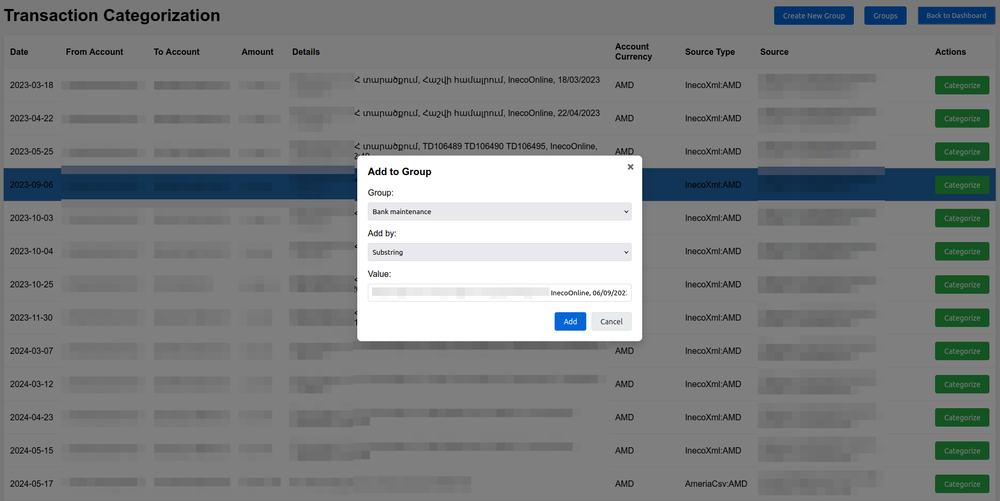
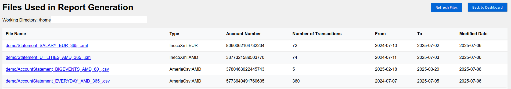
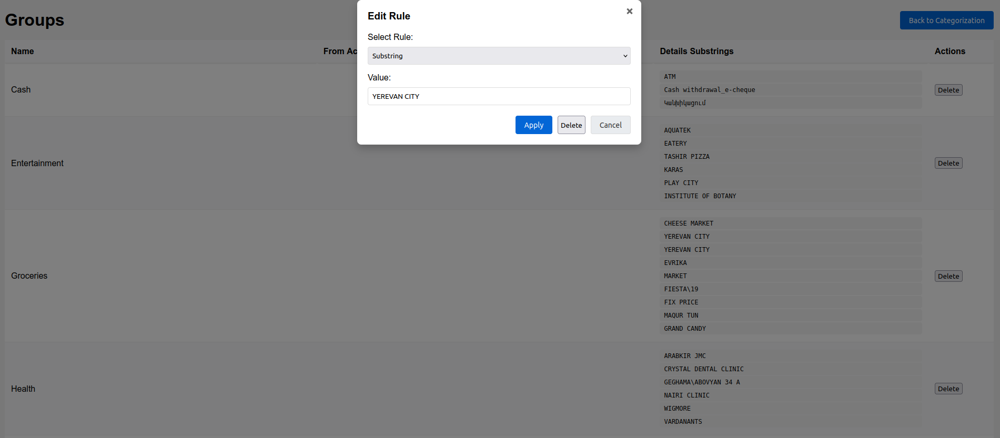

# AM BudgetView
Local tool to investigate your expenses and incomes by bank transactions.

Was renamed from [aggregate-inecobank-statement](https://github.com/AlexanderMakarov/aggregate-inecobank-statement) after new banks and features were added.

----

To control your budget you need to know all expenses and incomes, right?
If you pay with plastic card or NFC application on the smartphone you
probably already have all your transactions written by bank already.
They even send you them in monthly emails.
There are tools which allows to prepare accounting reports from them, like https://beancount.io/.
But it is too time-intensive to went through all (thousands of them) transactions manually
and next need to have accounting knowledge to understand results.
Using LLM-based solution (ChatGPT/Claude) also quite risky both from privacy/security
and halluciantion points of view (they may provide wrong results and expose your data).

This application is a simple and completely local tool which allows to setup 
categorization rules for all transactions from multiple accounts and banks into your custom groups.
Next it allows to normalize them to one currency and explore on handy charts
with ability to drill-down to details and tune categorization rules for your own needs.

Results are:

### 1. Browser page with aggregated information about your budget in intuitive charts:

Automatically opens browser with local UI:








### 2. Text report with most important and structured insights into your budget.

See example (numbers are made up, sum may not match):
```
Statistics for        2024-07-01..2024-07-31 (in    AMD):
  Income  (total  1 groups, filtered sum     423,492.56):
    Salary                               :   423,492.56
  Expenses (total  8 groups, filt-ed sum     144,280.89):
    Utilities and rent                   :    93,436.50
    Subscriptions                        :    11,565.97
    Groceries                            :     9,171.25
    Entertainment                        :     7,964.78
    Taxi                                 :     7,806.02
    Pharmacies                           :     5,255.99
    Health                               :     4,892.15
    Online shopping                      :     4,188.23
Statistics for        2024-08-01..2024-08-31 (in    AMD):
...
```

### 3. [Beancount](https://github.com/beancount/beancount) file with app available accounting details for further exploration in [Fava UI](https://github.com/beancount/fava).


## List of supported banks, file formats and relevant notes

In short supported:
- Inecobank individual accounts,
- AmeriaBank both individual (aka MyAmeria) and legal accounts,
- Ardshinbank both individual and legal accounts,
- Generic (manually/customly mapped) CSV files with transactions.

Banks usually send transactions/statements by email monthly or yearly
and allows to download list of transactions on their websites.
Files received via email could be protected by password which is hard to handle in app.
Additionally files from emails usually don't contain Reciever/Payer account number
and it makes them much less valuable because:
1. account-based categorization won't work,
2. transfers between "my accounts" can't be detected and will be counted as "other income" and "other expense" thus distorting statistics/sums,
3. Beancount report won't be full.

### Inecobank
- [FULL] Inecobank XML (.xml) files downloaded per-account from https://online.inecobank.am/vcAccount/List
  (click on account, choose dates range, icon to download in right bottom corner).
  Supports all features native to app and Beancount reports.
  In `config.yaml` is referenced by `inecobankStatementXmlFilesGlob` setting.
  Parsed by [ineco_xml_parser.go](/ineco_xml_parser.go).
- [NONE] Inecobank Excel (.xls) files downloaded per-account from https://online.inecobank.am/vcAccount/List
  (the same place as XML above) - ARE NOT SUPPORTED because XML downloaded from the same place
  is simpler format for parsing.
- [PARTIAL] Inecobank Excel (.xlsx) files which Inecobank sends in emails with password protection.
  Don't have Reciever/Payer account number so account-based categorization won't work
  and resulting Beancount report won't be full.
  To allow app use such files need to remove password protection first
  ([MS Office instruction](https://support.microsoft.com/en-us/office/change-or-remove-workbook-passwords-1c17af87-25e2-4dc6-94f0-19ce21ad0b68),
  [LibreOffice instruction](https://ask.libreoffice.org/t/remove-file-password-protection/30982)).
  In `config.yaml` is referenced by `inecobankStatementXlsxFilesGlob` setting.
  Parsed by [ineco_excel_parser.go](/ineco_excel_parser.go).

### AmeriaBank (Ameria for Business)
- [FULL] AmeriaBank for Businesses CSV (.CSV) files downloaded per-account from
  https://online.ameriabank.am/InternetBank/MainForm.wgx, click on account -> Statement,
  chose period (for custom use "FromDate" and "To" date pickers),
  set "Show equivalent in AMD" checkbox (to have exchange rates),
  press "Export to CSV" icon is placed at right top corner.
  Supports all features native to app and Beancount reports.
  In `config.yaml` is referenced by `ameriaCsvFilesGlob` setting.
  Parsed by [ameria_csv_parser.go](/ameria_csv_parser.go).
- [NONE] AmeriaBank for Businesses XML (.XML) files downloaded per-account from
  https://online.ameriabank.am/InternetBank/MainForm.wgx
  (the same place as CSV above) - ARE NOT SUPPORTED because they don't contain
  own Reciever/Payer account number and currency.
- [NONE] AmeriaBank for Businesses XLSX (.xlsx) files received via email.
  They don't contain Reciever/Payer account number.

### MyAmeria (Ameria for Inidividuals)
- [FULL] MyAmeria History Excel (.xls) file downloaded from https://myameria.am/history.
  Press on "Filter" button at right, set right dates (leave other fields as is),
  press "Excel" button in "Actions" section at right.
  Only one file is needed because it contains transactions for all accounts and cards.
  In `config.yaml` is referenced by `myAmeriaHistoryXlsFilesGlob` setting.
  Note that it should be accompanied by `myAmeriaMyAccounts` map with "my"
  account numbers and currencies because file doesn't provide this data.
  Otherwise most of application features won't work and parser would fail with error in terminal.
  Supports features native to app and Beancount reports except for exchange rates
  which are not provided in this file as well.
  Parsed by [ameria_history_parser.go](/ameria_history_parser.go).
  !!! There is an option to **download such files automatically** via
  [bank_downloader.py](/scripts/bank_downloader.py) script.
  Copy [scripts/bank_dowloader_config.yaml.template](/scripts/bank_dowloader_configak.yaml.template)
  into new file `bank_dowloader_config.yaml` in "scripts" folder and fill in your data.
  Run `python scripts/bank_downloader.py` (or `make bank-downloader`) to download statements.
  Note that due to script gets data directly from bank's API it generates "Generic" CSV file
  (not "MyAmeria History Excel") to provide information about multiple accounts in one file.
- [OUTDATED, backwards compatibility] MyAmeria Account Statements Excel (.xls)
  dowloaded from pages like https://myameria.am/cards-and-accounts/account-statement/******.
  before 2025. Note that it haven't worked for cards, only for accounts.
  Left for backward compatibility with files downloaded before 2025 (was the main source of data in here),
  in 2025 use '2025+ History Excel' option.
  In `config.yaml` is referenced by `myAmeriaAccountStatementXlsxFilesGlob` setting.
  Parsed by [ameria_stmt_parser.go](/ameria_stmt_parser.go).
- [NONE] MyAmeria Account/Card Statements CSV downloaded from pages like
  https://myameria.am/cards-and-accounts/account-statement/****** and
  https://myameria.am/cards-and-accounts/card-statement/****** in 2025+.
  Bank changed format somewhere in border of 2024-2025 and new format doesn't have
  receiver/sender account number and doesn't have amount in native bank currency,
  therefore has less data than '2025+ History Excel' option.

### Ardshinbank
- [FULL] Ardshinbank XLSX files received via email. They could be monthly or yearly,
  inside there are 3 sheets: English, Russian and Armenian.
  Account number of a peer (receiver or sender) looks like could only be inner
  Ardshinbank account number, which limits ability to track "transfer my own funds"
  from other banks.
  Supports all features native to app and Beancount reports.
  In `config.yaml` is referenced by `ardshinbankXlsxFilesGlob` setting.
  Parsed by [ardshin_xlsx_parser.go](/ardshin_xlsx_parser.go).

### Generic
- [FULL] Generic CSV files with transactions from the any source.
  In `config.yaml` is referenced by `genericCsvFilesGlob` setting.
  Parsed by [generic_csv_parser.go](/generic_csv_parser.go).
  Supports all features native to app and Beancount reports.
  Own account number and currency deduced from fields below.
  Required fields/headers (first row in file):
  - Date - string with date of the transaction in `YYYY-MM-DD` format.
  - FromAccount - string with account number of the sender.
  - ToAccount - string with account number of the receiver.
  - IsExpense - boolean value, true if the transaction is an expense
     (i.e, 'FromAccount' is your account),
     false if it is an income (i.e, 'ToAccount' is your account).
  - Amount - string with dot and 2 digits precision (like "1,500.30" for
     1500 dollars and 30 cents) with amount of the transaction.
  - Details - string with details/comments of the transaction.
  - AccountCurrency - 3 chars ISO code of the currency of the account.
  - OriginCurrency - 3 chars ISO code of the currency of the transaction before conversion.
  - OriginCurrencyAmount - string with amount of the transaction in origin currency.

To add new bank support please create an issue in repository with example of file
with transactions downloaded from the bank application and instructions how you got this file.
File may have values changes to hide sensitive information but of same format/length/character set.

# How to use

<details>
<summary>Инструкция на русском:</summary>

1. Загрузите исполняемый файл приложения (имя начинается с "am-budget-view-"), скомпилированный для вашей операционной системы со страницы
[Releases](https://github.com/AlexanderMakarov/am-budget-view/releases):
- Для Windows используйте "am-budget-view-windows-amd64.exe". Даже если у вас процессор Intel.
  Используйте версию "arm", только если у вас ARM процессор.
- Для Mac OS X с процессором M1+ используйте "am-budget-view-darwin-arm64".
  Для старых Macbook (до 2020 года) используйте "am-budget-view-darwin-amd64".
- Для большинства Linux-ов выберите "am-budget-view-linux-amd64".
2. Загрузите "Statement" файлы с банковских сайтов за требуемый период и
  поместите их рядом с исполняемым файлом ("am-budget-view-...").
  Подробности см. на [List of supported banks, file formats and relevant notes](#list-of-supported-banks-file-formats-and-relevant-notes).
  Все файлы необходимо поместить в ту же папку, где находится исполняемый файл
  ("am-budget-view-..."). Детали по банкам:
  - Для индивидуальных счетов Inecobank - откройте [Online Inecobank сайт](https://online.inecobank.am)
    выберите нужный счет, укажите в полях "From" и "To" необходимый диапазон,
    нажмите "Search", проскролльте страницу вниз, найдите в правом нижнем углу
    5 значков, нажмите на значок "XML" чтобы загрузить файл.
  - Для индивидуальных счетов Ameria откройте [My Ameria сайт](https://myameria.am/),
    выберите нужный счет, выберите опцию "Выписка" (справа),
    задайте необходимый диапазон ("Выбрать период"),
    выберите "Excel", нажмите "Скачать" чтобы загрузить файл.
  - Для юридических счетов Ameria откройте [Online Ameriabank сайт](https://online.ameriabank.am/),
    выберите "Счета" в левом меню, выберите нужный счет,
    нажмите кнопку "Выписка" вверху, в появившемся диалоговом окне задайте требуемый период,
    установите флажок "Показать эквивалент в AMD" (чтобы получить курсы обмена),
    нажмите "ОК", на новой вкладке "Выписка со счета" найдите 5 значков в правой средней части,
    нажмите на значок "Экспорт в CSV" чтобы загрузить файл.
  - Для "INECOBANK Statement" XLSL файлов которые Inecobank присылает на email для
    индивидуальных счетов - 
    (учтите что эти файлы не содержат "Reciever/Payer" номера счёта поэтому часть
    функционала не будет работать и лучше использовать "Statement" файлы с сайта)
    так как XLSL файлы защищены паролем то их нужно сохранить в папку приложения
    без защиты ([MS Office instruction](https://support.microsoft.com/en-us/office/change-or-remove-workbook-passwords-1c17af87-25e2-4dc6-94f0-19ce21ad0b68),
    [LibreOffice instruction](https://ask.libreoffice.org/t/remove-file-password-protection/30982)).
  - Для Ardshinbank просто поместите нужные XLSX файлы в папку приложения.
    Обратите внимание что если положить годовые и месячные файлы вместе то транзакции будут дублироваться.
1. Запустите приложение ("am-budget-view-\*-\*").
  Если все в порядке то через пару секунд откроется новая вкладка в браузере
  с агрегированными данными из банковских транзакций, которые были предоставлены через "Выписка" файлы.
  В противном случае откроется текстовый файл с описанием ошибки.
  В случае ошибки необходимо ее исправить чтобы продолжить работу.
  Самая распространенная ошибка — это когда файлы банковских транзакций, загруженные на шаге № 2,
  не соответствуют `inecobankStatementXmlFilesGlob`, `inecobankStatementXlsxFilesGlob`,
  `myAmeriaAccountStatementXlsxFilesGlob`, `ameriaCsvFilesGlob`,
  `myAmeriaHistoryXlsFilesGlob`
  [шаблонам поиска glob](https://ru.wikipedia.org/wiki/%D0%A8%D0%B0%D0%B1%D0%BB%D0%BE%D0%BD_%D0%BF%D0%BE%D0%B8%D1%81%D0%BA%D0%B0)
  объявленным в файле "config.yaml" (приложение создает файл "config.yaml" при первом запуске).
  При успешном запуске страница браузера, скорее всего, будет содержать несколько
  начальных категорий и одну большую категорию "Unknown" созданную из еще не
  категоризированных транзакций.
1. Для категоризации транзакций используйте кнопку "Категоризация транзакций" в правом
  верхнем углу. Откроется страница со списком не категоризованных транзакций где
  у каждый строки справа будет кнопка "Категоризовать". При нажатии на неё откроется
  модальное окно для создания нового правила категоризации.
  Окно содержит выбор категории, способа категоризации и значения.
  Приложение поддерживает следующие способы категоризации (типы правил):
  - "Подстрока" - выбранная подстрока ищется в столбце "Пометки".
  - "Со счёта" - выбранный номер счёта ищется в столбце "Со счёта".
  - "На счёт" - выбранный номер счёта ищется в столбце "На счёт".
  После нажатия на кнопку "Добавить" новое правило категоризации будет добавлено в
  конфигурационный файл "config.yaml" и страница будет обновлена с применением нового правила.
  Таким образом большой список транзакций можно будет категоризировать достаточно быстро.
  Если нужно добавить новую категорию то используйте кнопку "Создать новую категорию"
  в правом верхнем углу.
  Если нужно удалить уже существующую категорию или посмотреть все категории и правила
  то нажмите кнопку "Категории" - откроется отдельная страница со список категорий и
  кнопкой "Удалить" для каждой из них.
1. После того, как вы классифицируете все транзакции, вы получите готовый и интуитивно
  понятный отчет о расходах и доходах, сравнения месяцев, принятия финансовых решений и т.д.
  Обратите внимание, что чем больше счетов будет предоставлено приложению,
  тем более полной будет финансовая картина.
1. С прошествием времени достаточно добавить новые или обновить старые "Statement" файлы
  с новыми транзакциями и снова запустить приложение или нажать кнопку "Обновить файлы" в правом верхнем углу.
  Возможно потребуется добавить новые правила категоризации для новых транзакций.
  Конфигурационный файл "config.yaml" будет обновляться приложением и содержит все
  Ваши персональные правила категоризации.
</details>

Script in English:

1. Download the application executable file (name starts with "am-budget-view-")
   compiled for your operating system from the
   [Releases](https://github.com/AlexanderMakarov/am-budget-view/releases) page:
 	- For Windows use "am-budget-view-windows-amd64.exe". Even if you have an Intel CPU. Use "arm" version only if your CPU is ARM-based.
 	- For Mac OS X with M1+ CPU/core use "am-budget-view-darwin-arm64".
   	For older Macbooks (before 2020) use "am-budget-view-darwin-amd64".
 	- For most of Linux-es choose "am-budget-view-linux-amd64".
2. Download "Statement" files from bank sites for required period and
   put them near the executable file ("am-budget-view-...").
   See details on 
   [List of supported banks, file formats and relevant notes](#list-of-supported-banks-file-formats-and-relevant-notes).
   All files need to place in the same folder where the executable file
   ("am-budget-view-...") is placed. Details per bank:
   - For Inecobank individual accounts - open [Ineco Online main page](https://online.inecobank.am),
     click on the required account, set into 'From' and 'To' fields dates you want to analyze,
     press 'Search', scroll page to bottom, at the right corner look for 5 icons,
     press XML icon to download the file.
   - For Ameria individual accounts open [My Ameria main page](https://myameria.am/),
     click on the required account, choose "Statement" option at right,
     set required period (via "Select period" option),
     select "Excel", press "Download" to download the file.
   - For Ameria legal accounts open [Ameriabank main page](https://online.ameriabank.am/),
     select "Accounts" in left menu, select on the required account,
     press "Statement" option at top, in appeared dialog set required period,
     set "Show equivalent in AMD" checkbox (to have exchange rates), press "OK",
     in new "Account Statement" tab look for 5 icons at the middle right,
     press "Export to CSV" to download the file.
   - For "INECOBANK Statement" XLSL files which Inecobank sends for
     individual accounts - 
     (note that these files don't contain "Reciever/Payer" account number
     so some functionality won't work and it's better to use "Statement" files from the site)
     since XLSL files are protected by password they need to be saved in the application folder
     without protection ([MS Office instruction](https://support.microsoft.com/en-us/office/change-or-remove-workbook-passwords-1c17af87-25e2-4dc6-94f0-19ce21ad0b68),
     [LibreOffice instruction](https://ask.libreoffice.org/t/remove-file-password-protection/30982)).
   - For Ardshinbank simply put required XLSX files in the application folder.
     Note that if you put yearly and monthly files together then transactions would be duplicated.
3. Run application ("am-budget-view-\*-\*" file).
   If everything is OK then after a couple of seconds it would open a new tab in browser
   with aggregated details from bank transactions which where provided via "Statement" files.
   Otherwise it would open a text file with the error description.
   In case of an error it is required to fix it to proceed.
   Most common error is when bank transactions files downloaded on #2 step
   doesn't match `inecobankStatementXmlFilesGlob`, `inecobankStatementXlsxFilesGlob`,
   `myAmeriaAccountStatementXlsxFilesGlob`, `ameriaCsvFilesGlob`,
   `myAmeriaHistoryXlsFilesGlob`
   [glob file patterns](https://en.wikipedia.org/wiki/Glob_(programming))
   declared in "config.yaml" file (app would create default "config.yaml" file near it).
   But in a successful case browser page most probably would contain some pre-defined groups
   and one big "Unknown" group made from all uncategorized yet transactions.
4. To categorize transactions use "Transaction Categorization" button at the top right.
   It would open a page with a list of uncategorized transactions where each row would have
   a "Categorize" button on the right. When pressed it would open a modal window for creating
   a new categorization rule.
   This window contains group (category) selection, rule type and value.
   Application supports the following categorization types (rule types):
   - "Substring" - selected substring is searched in "Details" column. Most popular but lowest by priority.
   - "From Account" - selected account number is searched in "From Account" column.
   - "To Account" - selected account number is searched in "To Account" column.
   After pressing "Add" button new categorization rule would be added to
   "config.yaml" file and page would be updated with new rule applied.
   Thus a big list of transactions could be categorized quickly if use wide enough rules.
   If you need to add a new category use "Create New Group" button at the top right.
   If you need to delete an existing category or see all categories and rules
   then press "Groups" button - it would open a separate page with a list of groups
   (categories) with abilities to modify relevant rules.
5. After you categorize all transactions you would get a ready and intuitive report
   about expenses and incomes, comparison of months, making financial decisions and so on.
   Note that more statement files are provided to the application, the more full financial
   picture would be. So try to add all accounts you have.
6. With time it is enough to add new or update old "Statement" files with new transactions
   and run application again or press "Refresh Files" button at the top right.
   It may be required to add new categorization rules for new transactions.
   File "config.yaml" would be updated by application and contains all your personal categorization rules.

### Notes:
1. Files which banks are sending in emails not always have all required information.
2. It is a command line application and may work completely in the terminal.
   Run it with `-h` for details.
   It would explain how to work with multiple configuration files and see information directly in terminal.
3. Application automatically starts in "local HTTP server mode" and opens in a default browser.
   No external requests are made.
4. Application supports 3 "reporting" modes: 'web' - default,
   'file' - to open text report in TXT files veiwer,
   'none' - only STDOUT (appeared first historically).
5. In "not web" mode application also supports "categorization" in interactive mode
   - need to set `categorizeMode: true` in configuration file.
   This mode is useful to find transactions without categories.

# Use with Beancount and Fava UI

Application by-default generates [Beancount](https://github.com/beancount/beancount) file
which then could be viewed in [Fava UI](https://github.com/beancount/fava).
Beancount report allows to do full double-entry accounting.
It could be hard to understand for those who don't have solid accounting knowledge,
so consider to use built-in HTML UI instead.

To install Fava UI (built with Python) run something like `pip3 install fava`.

After getting log like `Built Beancount file 'AM Budget View.beancount' with 1818 transactions.`
from am-budget-view run in the same folder `fava AM\ Budget\ View.beancount` - it should print
`Starting Fava on http://127.0.0.1:5000`. Open this link in browser and it would show
graphs and other accounting visualization, financial statistic about your transactions.
To regenerate Beancount report (for example with corrected configuration)
need to re-run am-budget-view (it generates this file only once)
while Fava UI would catch up changes by pressing relevant button in page.

# Limitations

- Application does not have currencies exchange rates source other than transactions files you provide to it.
  Because it is designed to work completely offline.
  While it performs quite precise conversions using only scarse information from transaction files.
  It converts currencies with direct exchange rates first, next with best multi-hop conversion option
  found by Dijkstra algorithm. Precision is measured as a number of days between current day and each
  exchange rate date used for conversion hop, with one exception - even if target date is the same date
  where we have direct exchange rate then precision would be 1, because precision 0 means "no conversion",
  i.e. transaction currency is a target currency.
- Application does not support a way to categorize transactions in a different way for different accounts/banks.

# Contributions

Feel free to contribute your features, fixes and so on.

It is usual Go repo with some useful shortcuts in [Makefile](/Makefile).

# Development

## Setup

- Install Go v1.21+
- `go mod init`
- Made your changes, run test via [Makefile](/Makefile) targets and test manually with `go run .`
- Make PR.

## Release
Merge to "master", next push tag with name "releaseX.X.X" and some comment to put into release log.
CI will do the rest.

## Demo data

Demo data files are generated by [generate_demo.py](/scripts/generate_demo.py) script and allows
to try application for yourself with synthetic data.

To run application with demo data execute `go run . config-demo.yaml`.

To generate different demo data setup "main" function in [generate_demo.py](/scripts/generate_demo.py)
and run it via `make generate-demo` (needs exactly Python 3.12) or alike.
It would generate files in `demo` folder.

## TODO/Roadmap

- [x] Fail if wrong field in config found.
- [x] Add CI for pull requests (different branches).
- [x] Parse CSV-s from online.ameriabank.am.
- [x] Propagate not fatal errors from parsing files into report.
- [x] Parse XLS-s from myameria.am.
- [x] Parse InecoBank XLS files which are sent in emails and
      InecoBank doesn't allow to download data older than 2 years.
- [x] Rename repo to don't be tied to Inecobank.
- [x] Build translator to https://github.com/beancount/beancount
      Check in https://fava.pythonanywhere.com/example-beancount-file/editor/#
- [x] Add currencies support in UI.
- [x] Provide rates conversion precision in UI and other reports.
- [x] Add drill-down page to see individual journal entries.
- [x] Solve double counting of transactions between own accounts.
- [x] Enhance errors when no transaction files found.
- [x] Make default config.yaml on first run if not found.
- [x] Translate to Russian.
- [x] Avoid situation when port is binded by previous app instance.
- [x] Write instruction about both options for Ameriabank transactions.
- [x] Enable categorization by accounts, like "expense to this account is a rent".
- [x] Add "Categorization" page in UI and relevant functionality.
- [x] Add "Edit" actions to "Groups" page (to revert wrong change).
- [x] Traceability of files - show list of files used for report generation.
- [x] `Transaction` format CSV file parser.
      This is to allow load data from any source (not only Inecobank and Ameria).
- [x] In "Transactions" page show rule which categorized transaction with ability to delete it.
- [x] Collect more details about accounts.
- [x] Handle currencies on "Categorization" page (now "Amount" in different currencies).
- [x] Add good demo data, write instruciton how to use it (speed up releases and build trust in app).
- [x] Add way (button) to re-read statement files.
- [x] Add switcher to "Categorization" page to hide "between my accounts" transactions.
- [x] Download MyAmeria History Excel files.
- [x] Add Ardshinbank support. Update README.md.
- [x] Fix editing rule on "Groups" page (e.g. edit substring to smaller).
- [x] Add ability to set "my accounts" in config.yaml. To don't count transactions to "not connected" banks/accounts.
- [x] Add zoom to main diagrams (when multiple years are shown). Default 1 year.
- [x] Add demo files to allow fast "try for myself".
- [x] Explain in README.md `ameria_xls_stmt_parser.go` logic (outdated, for backwards compatibility, explain other MyAmeria/Ameria Business files (un)support details.
- [ ] (wait response from bank on relevant issue) Handle MyAmeria "History" file bug with wrong month number (8 for September).
- [ ] Add ACBA bank support (Armenian files due to more data in them).
- [ ] Add config-based rates (https://github.com/AlexanderMakarov/am-budget-view/issues/8)
- [ ] Add Russian translation for '## List of supported banks, file formats and relevant notes' section in README.md.
- [ ] Record new video(s) with instructions.
- [ ] Download account statements from Ameria Business and Inecobank via Playwright.
- [ ] Render [Sankey diagram](https://www.getrichslowly.org/sankey-diagrams/) or similar. Migrate to v6 ECharts.
- [ ] Manage all settings (config.yaml) in web UI, separate page.
- [ ] Fix sources folders structure, see https://appliedgo.com/blog/go-project-layout
- [ ] (? value vs complexity) Take manual transactions for "not connected" banks/accounts.
- [ ] (? value vs complexity) Store notes per transactions and per rules.
- [ ] (? small value) Search for overlapping rules.
- [ ] (? confusing) Support group to ignore some transactions as "to me". Because:
      a) user may have transactions from not-provided bank accounts.
      b) transaction between banks may happen under different account.
      c) currency exchange inside the same bank may happen under different account.
- [ ] (? small value) Add ability to download as HTML report.
- [ ] (? small value) Add translation to all parsers and set right Russian declensions.
- [ ] (? value vs complexity) Allow to choose "transactions" files in UI.
- [ ] (? unclear value) Add multi-currency support: call https://open.er-api.com/v6/latest/AMD
- [ ] (? impossible) Support different schemas with parsing. Aka "parse anything".
- [ ] (? not enough feedback) Improve tests coverage.
- [x] ~~Download account statements from MyAmeria~~ Actually appears useless because doesn't work for cards and "History" contains all transactions.
- [ ] ~~Build UI with Fyne and https://github.com/wcharczuk/go-chart
      (https://github.com/Jacalz/sparta/commit/f9927d8b502e388bda1ab21b3028693b939e9eb2).~~
      There are issues with [performance and charts flexibility](https://github.com/fyne-io/fyne/issues/2228) this way.
