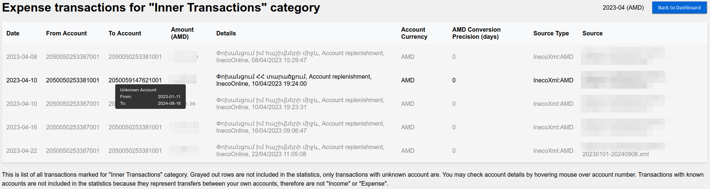
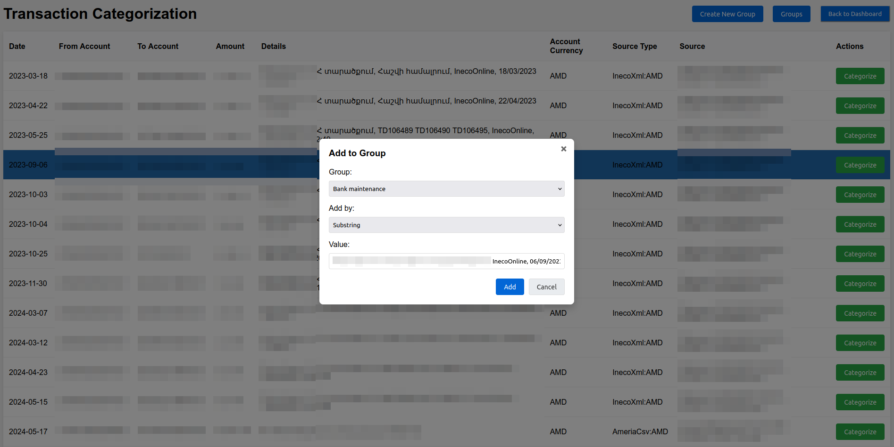
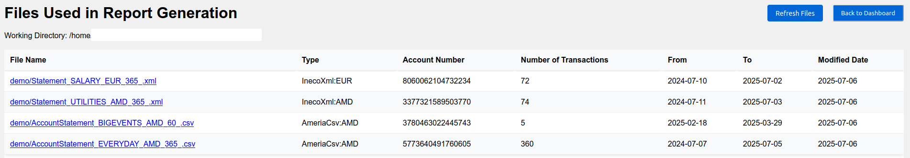
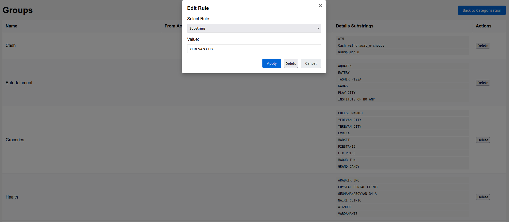
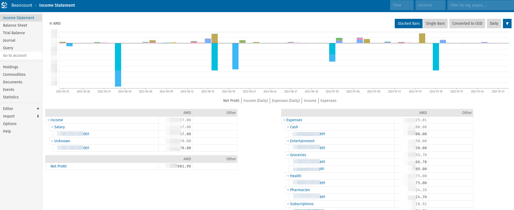

# AM BudgetView
Local tool to investigate your expenses and incomes by bank transactions.

Was renamed from [aggregate-inecobank-statement](https://github.com/AlexanderMakarov/aggregate-inecobank-statement) after new banks and features were added.

----

To control your budget you need to know all expenses and incomes, right?
Manually recording all transactions is too time-intensive and error-prone.
While nowadays we are usually paying with cards and 
all our transactions are already recorded by our banks.
Banks even send us long lists of these transactions in monthly emails.
Looking through all (thousands of them) transactions manually is too time-intensive and error-prone.
Using AI/LLM-based solution (ChatGPT/Gemeni/etc.) is quite risky both from privacy/security
and halluciantion points of view (they may provide wrong results and expose your data).

So this application is a simple to use and completely local tool to explore your finances aggregated from your transactions on multiple handy charts.
It allows to categorize transactions into custom groups, 
drill-down to details of each category, normalize amounts to multiple currencies and do everything completely offline (even without internet connection).

Results are:

### 1. Browser page with aggregated information about your budget in intuitive charts:








### 2. Text report with most important and structured insights into your budget.

See example (numbers are made up, sum may not match):
```
Statistics for        2024-07-01..2024-07-31 (in    AMD):
  Income  (total  1 groups, filtered sum     423,492.56):
    Salary                               :   423,492.56
  Expenses (total  8 groups, filt-ed sum     144,280.89):
    Utilities and rent                   :    93,436.50
    Subscriptions                        :    11,565.97
    Groceries                            :     9,171.25
    Entertainment                        :     7,964.78
    Taxi                                 :     7,806.02
    Pharmacies                           :     5,255.99
    Health                               :     4,892.15
    Online shopping                      :     4,188.23
Statistics for        2024-08-01..2024-08-31 (in    AMD):
...
```

### 3. [Beancount](https://github.com/beancount/beancount) double-entry accounting details for exploration in [Fava UI](https://github.com/beancount/fava).



Application supports two languages for now: English and Russian.

## Supported banks and how to get transaction files

Supported: Inecobank, AmeriaBank (business and MyAmeria individual), Ardshinbank, ACBA, and Generic CSV.

Per-bank docs live in [docs/en/banks/](docs/en/banks/overview.md) (English) and [docs/ru/banks/](docs/ru/banks/overview.md) (Russian). **Recommended for MyAmeria and Ameria Business:** open [Files](/files) → **Download settings** (since date, Client ID) → **Download now** (paste fresh token or cookie from browser DevTools; not saved). Manual website export is documented per bank.

Email statement files are often less usable (password protection, missing account numbers). Prefer website downloads where possible — see bank docs for details.

# How to use

<details>
<summary>Инструкция на русском:</summary>

1. Загрузите исполняемый файл приложения (имя начинается с "am-budget-view-"), скомпилированный для вашей операционной системы со страницы
[Releases](https://github.com/AlexanderMakarov/am-budget-view/releases):
- Для Windows используйте "am-budget-view-windows-amd64.exe". Даже если у вас процессор Intel.
  Используйте версию "arm", только если у вас ARM процессор.
- Для Mac OS X с процессором M1+ используйте "am-budget-view-darwin-arm64".
  Для старых Macbook (до 2020 года) используйте "am-budget-view-darwin-amd64".
- Для большинства Linux-ов выберите "am-budget-view-linux-amd64".
1. Скачайте statement/transactions файлы из банковских сайтов или электронных писем и
  поместите их рядом с исполняемым файлом ("am-budget-view-...").
  Подробности см. в [docs/ru/banks/](docs/ru/banks/overview.md) или на странице «Файлы» в приложении.
1. Запустите приложение ("am-budget-view-\*-\*").
  Если все в порядке то через пару секунд откроется новая вкладка в браузере
  с агрегированными данными из банковских транзакций, которые были предоставлены через "Выписка" файлы.
  В противном случае откроется текстовый файл с описанием ошибки.
  В случае ошибки необходимо ее исправить чтобы продолжить работу.
  Самая распространенная ошибка — это когда файлы банковских транзакций, загруженные на шаге № 2,
  не соответствуют `inecobankStatementXmlFilesGlob`, `inecobankStatementXlsxFilesGlob`,
  `myAmeriaAccountStatementXlsxFilesGlob`, `ameriaCsvFilesGlob`,
  `myAmeriaHistoryXlsFilesGlob`
  [шаблонам поиска glob](https://ru.wikipedia.org/wiki/%D0%A8%D0%B0%D0%B1%D0%BB%D0%BE%D0%BD_%D0%BF%D0%BE%D0%B8%D1%81%D0%BA%D0%B0)
  объявленным в файле "config.yaml" (приложение создает файл "config.yaml" при первом запуске).
  При успешном запуске страница браузера, скорее всего, будет содержать несколько
  начальных категорий и одну большую категорию "Unknown" созданную из еще не
  категоризированных транзакций.
1. Для категоризации транзакций используйте кнопку "Категоризация транзакций" в правом
  верхнем углу. Откроется страница со списком не категоризованных транзакций где
  у каждый строки справа будет кнопка "Категоризовать". При нажатии на неё откроется
  модальное окно для создания нового правила категоризации.
  Окно содержит выбор категории, способа категоризации и значения.
  Приложение поддерживает следующие способы категоризации (типы правил):
  - "Подстрока" - выбранная подстрока ищется в столбце "Пометки".
  - "Со счёта" - выбранный номер счёта ищется в столбце "Со счёта".
  - "На счёт" - выбранный номер счёта ищется в столбце "На счёт".
  После нажатия на кнопку "Добавить" новое правило категоризации будет добавлено в
  конфигурационный файл "config.yaml" и страница будет обновлена с применением нового правила.
  Таким образом большой список транзакций можно будет категоризировать достаточно быстро.
  Если нужно добавить новую категорию то используйте кнопку "Создать новую категорию"
  в правом верхнем углу.
  Если нужно удалить уже существующую категорию или посмотреть все категории и правила
  то нажмите кнопку "Категории" - откроется отдельная страница со список категорий и
  кнопкой "Удалить" для каждой из них.
1. После того, как вы классифицируете все транзакции, вы получите готовый и интуитивно
  понятный отчет о расходах и доходах, сравнения месяцев, принятия финансовых решений и т.д.
  Обратите внимание, что чем больше счетов будет предоставлено приложению,
  тем более полной будет финансовая картина.
1. С прошествием времени достаточно добавить новые или обновить старые "Statement" файлы
  с новыми транзакциями и снова запустить приложение или нажать кнопку "Обновить файлы" в правом верхнем углу.
  Возможно потребуется добавить новые правила категоризации для новых транзакций.
  Конфигурационный файл "config.yaml" будет обновляться приложением и содержит все
  Ваши персональные правила категоризации.
</details>

Script in English:

1. Download the application executable file (name starts with "am-budget-view-")
   compiled for your operating system from the
   [Releases](https://github.com/AlexanderMakarov/am-budget-view/releases) page:
 	- For Windows use "am-budget-view-windows-amd64.exe". Even if you have an Intel CPU. Use "arm" version only if your CPU is ARM-based.
 	- For Mac OS X with M1+ CPU/core use "am-budget-view-darwin-arm64".
   	For older Macbooks (before 2020) use "am-budget-view-darwin-amd64".
 	- For most of Linux-es choose "am-budget-view-linux-amd64".
2. Download statement/transaction files from bank websites or emails and
   put them near the executable file ("am-budget-view-...").
   See details in [docs/en/banks/](docs/en/banks/overview.md) or on the in-app Files page.
3. Run application ("am-budget-view-\*-\*" file).
   If everything is OK then after a couple of seconds it would open a new tab in browser
   with aggregated details from bank transactions which where provided via "Statement" files.
   Otherwise it would open a text file with the error description.
   In case of an error it is required to fix it to proceed.
   Most common error is when bank transactions files downloaded on #2 step
   doesn't match `inecobankStatementXmlFilesGlob`, `inecobankStatementXlsxFilesGlob`,
   `myAmeriaAccountStatementXlsxFilesGlob`, `ameriaCsvFilesGlob`,
   `myAmeriaHistoryXlsFilesGlob`
   [glob file patterns](https://en.wikipedia.org/wiki/Glob_(programming))
   declared in "config.yaml" file (app would create default "config.yaml" file near it).
   But in a successful case browser page most probably would contain some pre-defined groups
   and one big "Unknown" group made from all uncategorized yet transactions.
4. To categorize transactions use "Transaction Categorization" button at the top right.
   It would open a page with a list of uncategorized transactions where each row would have
   a "Categorize" button on the right. When pressed it would open a modal window for creating
   a new categorization rule.
   This window contains group (category) selection, rule type and value.
   Application supports the following categorization types (rule types):
   - "Substring" - selected substring is searched in "Details" column. Most popular but lowest by priority.
   - "From Account" - selected account number is searched in "From Account" column.
   - "To Account" - selected account number is searched in "To Account" column.
   After pressing "Add" button new categorization rule would be added to
   "config.yaml" file and page would be updated with new rule applied.
   Thus a big list of transactions could be categorized quickly if use wide enough rules.
   If you need to add a new category use "Create New Group" button at the top right.
   If you need to delete an existing category or see all categories and rules
   then press "Groups" button - it would open a separate page with a list of groups
   (categories) with abilities to modify relevant rules.
5. After you categorize all transactions you would get a ready and intuitive report
   about expenses and incomes, comparison of months, making financial decisions and so on.
   Note that more statement files are provided to the application, the more full financial
   picture would be. So try to add all accounts you have.
6. With time it is enough to add new or update old "Statement" files with new transactions
   and run application again or press "Refresh Files" button at the top right.
   It may be required to add new categorization rules for new transactions.
   File "config.yaml" would be updated by application and contains all your personal categorization rules.

### Notes:
1. It is a command line application and may work completely in the terminal.
   Run it with `-h` for details.
   It would explain how to switch between configuration files and get information directly in terminal.
2. By-default application automatically starts in "local HTTP server mode" and opens page in a default browser.
   No external requests are made.
3. Application supports 3 "reporting" modes:
   - 'web' - default,
   - 'file' - to open text report in TXT files veiwer,
   - 'none' - only STDOUT (appeared first historically).
4. In "not web" mode application supports "categorization" flow in interactive mode
   - need to set `categorizeMode: true` in configuration file.
   This mode is useful to find transactions without categories in terminal.

# Use with Beancount and Fava UI

Application generates [Beancount](https://github.com/beancount/beancount) file
which then could be viewed in [Fava UI](https://github.com/beancount/fava).
Beancount report allows to do full double-entry accounting.
It could be hard to understand for those who don't have solid accounting knowledge,
so consider to use built-in HTML UI instead.

To install Fava UI (built with Python) run something like `pip3 install fava`.

After getting log like `Built Beancount file 'AM Budget View.beancount' with 1818 transactions.`
from am-budget-view run in the same folder `fava AM\ Budget\ View.beancount` - it should print
`Starting Fava on http://127.0.0.1:5000`. Open this link in browser and it would show
graphs and other accounting visualization, financial statistic about your transactions.
To regenerate Beancount report (for example with corrected configuration)
need to re-run am-budget-view (it generates this file only once)
while Fava UI would catch up changes by pressing relevant button in page.

# Limitations

- Application is designed to work completely offline so it tries to parse currencies
  exchange rates from transactions files. Also it supports constant values from `exchangeRates` structure in "config.yaml" file.
  App converts currencies with direct exchange rates first, next with best
  (by dates difference) multi-hop conversion option found by Dijkstra algorithm.
  Precision is almost always measured as a number of days between current day and each exchange rate date used for conversion hop.
  When target date is the same date where we have direct exchange rate then precision still would be 1,
  because precision 0 means "no conversion", i.e. transaction currency is a target currency.
  For `exchangeRates` entries precision is always 100500 - app treats it as "rate for the date of the last provided transaction".
- Optional bank downloads (MyAmeria, Ameria Business) require browser session credentials; use the in-app Files page — see bank docs above.
- Application does not support a way to categorize transactions in a different way for different accounts/banks.

# Config.yaml file

The main configuration is stored in [config.yaml](/config.yaml) file.
This file is generated from binary on the first run in the folder where app was executed
and later is getting updated by the application if it was executed in "web" mode (default).

The main settings are explained directly in the file as comments.
Remained (optional and not important) settings are explained below.

- `uiPort` - port to use for local HTTP server. By default it is 8080.
- `timeZoneLocation` - time zone to use for the application. By default it is system timezone.
- `minCurrencyTimespanPercent` - minimum percentage of days between current day and exchange rate date to use it for conversion. By default it is 80%.
- `maxCurrencyTimespanGapDays` - maximum gap in days between current day and exchange rate date to use it for conversion. By default it is 30 days.
- `categorizeMode` - flag to just print details for all uncategorized transactions in terminal. Skips any other actions. By default it is false.

# Contributions

Feel free to contribute your features, fixes and so on.
It is a usual Go repository with some useful shortcuts in [Makefile](/Makefile).

# Development

## Setup

- Install Go v1.21+
- `go mod init`
- Made your changes, run test via [Makefile](/Makefile) targets and test manually with `go run .`
- Make a pull request.

## Release
Merge to "master", next push tag with name "releaseX.X.X" and some comment to put into release log.
CI will do the rest.

## Demo data

Demo data files are generated by [generate_demo.py](/scripts/generate_demo.py) script
and allows to try application for yourself with synthetic data.
Results of this script could be found in [`demo`](/demo) folder.

To run application from sources with demo data - execute `go run . config-demo.yaml`.
To run binary with demo data execute something like `am-budget-view-windows-amd64.exe config-demo.yaml`.

To generate different demo data - setup "main" function in [generate_demo.py](/scripts/generate_demo.py)
and run it via `make generate-demo` (needs exactly Python 3.12) or alike.
It would replace files in `demo` folder.

## TODO/Roadmap

<details>
<summary>Completed far ago:</summary>

- [x] Fail if wrong field in config found.
- [x] Add CI for pull requests (different branches).
- [x] Parse CSV-s from online.ameriabank.am.
- [x] Propagate not fatal errors from parsing files into report.
- [x] Parse XLS-s from myameria.am.
- [x] Parse InecoBank XLS files which are sent in emails and
      InecoBank doesn't allow to download data older than 2 years.
- [x] Rename repo to don't be tied to Inecobank.
- [x] Build translator to https://github.com/beancount/beancount
      Check in https://fava.pythonanywhere.com/example-beancount-file/editor/#
- [x] Add currencies support in UI.
- [x] Provide rates conversion precision in UI and other reports.
- [x] Add drill-down page to see individual journal entries.
- [x] Solve double counting of transactions between own accounts.
- [x] Enhance errors when no transaction files found.
- [x] Make default config.yaml on first run if not found.
- [x] Translate to Russian.
- [x] Avoid situation when port is binded by previous app instance.
- [x] Write instruction about both options for Ameriabank transactions.
- [x] Enable categorization by accounts, like "expense to this account is a rent".
- [x] Add "Categorization" page in UI and relevant functionality.
- [x] Add "Edit" actions to "Groups" page (to revert wrong change).
- [x] Traceability of files - show list of files used for report generation.
- [x] `Transaction` format CSV file parser.
      This is to allow load data from any source (not only Inecobank and Ameria).
- [x] In "Transactions" page show rule which categorized transaction with ability to delete it.
- [x] Collect more details about accounts.
- [x] Handle currencies on "Categorization" page (now "Amount" in different currencies).
- [x] Add good demo data, write instruciton how to use it (speed up releases and build trust in app).
- [x] Add way (button) to re-read statement files.
- [x] Add switcher to "Categorization" page to hide "between my accounts" transactions.
- [x] Download MyAmeria History Excel files.

</details>

Recent:
- [x] Add Ardshinbank support. Update README.md.
- [x] Fix editing rule on "Groups" page (e.g. edit substring to smaller).
- [x] Add ability to set "my accounts" in config.yaml. To don't count transactions to "not connected" banks/accounts.
- [x] Add zoom to main diagrams (when multiple years are shown). Default 1 year.
- [x] Add demo files to allow fast "try for myself".
- [x] Explain in README.md `ameria_xls_stmt_parser.go` logic (outdated, for backwards compatibility, explain other MyAmeria/Ameria Business files (un)support details.
- [x] Add ACBA bank support (Armenian files due to more data in them).
- [x] Add config-based rates (https://github.com/AlexanderMakarov/am-budget-view/issues/8)
- [x] Add description of all configuration options in README.md.
- [x] Add Russian translation for bank documentation (moved to docs/ru/banks/).
- [ ] Record new video(s) with instructions.
- [ ] Download account statements from Ameria Business and Inecobank via Playwright.
- [ ] Detect overlapping rules, i.e. one transaction could be categorized by multiple rules.
- [ ] Render [Sankey diagram](https://www.getrichslowly.org/sankey-diagrams/) or similar. Migrate to v6 ECharts.
- [ ] Manage all settings (config.yaml) in web UI, separate page.
- [x] Improve sources folders structure, see https://appliedgo.com/blog/go-project-layout
- [ ] (? value vs complexity) Take manual transactions for "not connected" banks/accounts.
- [ ] (? value vs complexity) Store notes per transactions and per rules.
- [ ] (? value vs complexity) Improve tests coverage.
- [ ] (? confusing) Support group to ignore some transactions as "to me". Because:
      a) user may have transactions from not-provided bank accounts.
      b) transaction between banks may happen under different account.
      c) currency exchange inside the same bank may happen under different account.
- [ ] (? small value) Add ability to download as HTML report.
- [ ] (? small value) Translate all parsers errors and set right Russian declensions.
- [ ] (? value vs complexity) Allow to choose "transactions" files in UI.
- [ ] (? against design, complexity) Download exchange rates (like https://open.er-api.com/v6/latest/AMD).
- [ ] (? impossible) Support different schemas with parsing. Aka "parse anything".
- [x] ~~Download account statements from MyAmeria~~ Useless because doesn't work for cards and "History" contains all transactions.
- [ ] ~~Build UI with Fyne and https://github.com/wcharczuk/go-chart
      (https://github.com/Jacalz/sparta/commit/f9927d8b502e388bda1ab21b3028693b939e9eb2).~~
      There were issues with [performance and charts flexibility](https://github.com/fyne-io/fyne/issues/2228) this way.
