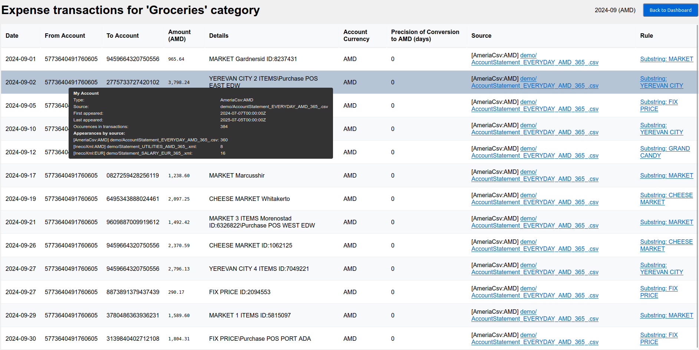
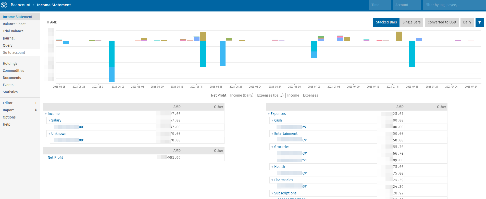

# AM BudgetView
Local tool to investigate your expenses and incomes by bank transactions.

Was renamed from [aggregate-inecobank-statement](https://github.com/AlexanderMakarov/aggregate-inecobank-statement) after new features were added.

----

To control your budget you need to know all expenses and incomes, right?
But it is too time-intensive to note all expenses and incomes manually, each day.
Fortunately banks do it for us already.
If you are using a bank plastic card or NFC application on the smartphone you probably have all your transactions written somewhere already.

For example Armenian's [Inecobank](https://online.inecobank.am)
and [Ameria Bank](https://ameriabank.am) allows to download list of all transactions in files.
They even send them in monthly emails.

So current application is a simple and completely local tool which allows to aggregate all transactions (hundreds of them) from
multiple accounts and banks into customizable groups.
Next it allows to normalize them to one currency and explore on handy charts with ability to drill-down to details.

Results are:

### 1. Browser page with aggregated information about your budget in intuitive charts:

Automatically opens browser with local UI:




### 2. Text report with most important and structured insights into your budget.

See example (numbers are made up, sum may not match):
```
Statistics for 2023-06-01..2023-06-30 (in AMD):
  Income  (total  2 groups, filtered sum 3,428,455.00):
    Salary                             : 1,935,000.00
    Unknown                            : 1,493,455.00
  Expenses (total 10 groups, filt-ed sum 1,027,553.69):
    To other account                   :   467,000.00
    Cash                               :   150,000.00
    Unknown                            :   136,575.00
    Groceries                          :   111,542.50
    Yandex Taxi                        :    59,600.00
    Health                             :    55,000.00
    Pharmacies                         :    31,684.39
    Wildberries                        :    11,110.00
    Entertainment                      :     4,800.00
    Subscriptions                      :       241.80
Statistics for 2023-07-01..2023-07-31 (in AMD):
...
```

### 3. [Beancount](https://github.com/beancount/beancount) file with app available accounting details for further exploration in [Fava UI](https://github.com/beancount/fava).




Some banks provide similar dashboards on their websites, but they can't assign good categories suitable for everyone.
This application allows you to configure categorization for your personal set of groups and completely automatically.

## List of supported banks, file formats and relevant notes
- [FULL] Inecobank XML (.xml) files downloaded per-account from https://online.inecobank.am/vcAccount/List
  (click on account, choose dates range, icon to download in right bottom corner).
  Supports all features native to app and Beancount reports.
  In `config.yaml` is referenced by `inecobankStatementXmlFilesGlob` setting.
  Parsed by [ineco_xml_parser.go](/ineco_xml_parser.go).
- [NONE] Inecobank Excel (.xls) files downloaded per-account from https://online.inecobank.am/vcAccount/List
  (the same place as XML above) - ARE NOT SUPPORTED because XML downloaded from the same place
  is more light and predictable format for parsing.
- [PARTIAL] Inecobank Excel (.xlsx) files which Inecobank sends in emails with password protection.
  Don't have Reciever/Payer account number so resulting Beancount report won't be full.
  To allow app use such files need to unprotect them first (
  [MS Office instruction](https://support.microsoft.com/en-us/office/change-or-remove-workbook-passwords-1c17af87-25e2-4dc6-94f0-19ce21ad0b68),
  [LibreOffice instruction](https://ask.libreoffice.org/t/remove-file-password-protection/30982)).
  In `config.yaml` is referenced by `inecobankStatementXlsxFilesGlob` setting.
  Parsed by [ineco_excel_parser.go](/ineco_excel_parser.go).
- [FULL] AmeriaBank for Businesses CSV (.CSV) files downloaded per-account from
  https://online.ameriabank.am/InternetBank/MainForm.wgx, click on account -> Statement,
  chose period (for custom use "FromDate" and "To" date pickers),
  set "Show equivalent in AMD" checkbox, press "Export to CSV" icon is placed at right top corner.
  Supports all features native to app and Beancount reports.
  In `config.yaml` is referenced by `ameriaCsvFilesGlob` setting.
  Parsed by [ameria_csv_parser.go](/ameria_csv_parser.go).
- [NONE] AmeriaBank for Businesses XML (.XML) files downloaded per-account from
  https://online.ameriabank.am/InternetBank/MainForm.wgx
  (the same place as CSV above) - ARE NOT SUPPORTED
  XML files from "Transactions" tab - they don't contain own Reciever/Payer account number and currency.
- [FULL] MyAmeria Account Statements Excel (.xls) dowloaded from pages like
  https://myameria.am/cards-and-accounts/account-statement/******.
  On the web site choose Cards and Accounts -> Current account -> Statement,
  here select period (last option usually), if available the set "In AMD" (under "Show also"),
  choose "Excel" format, press "Download". Almost the same in mobile app.
  Default file name "<account_number> account statement.xls".
  Supports all features native to app and Beancount reports.
  In `config.yaml` is referenced by `myAmeriaAccountStatementXlsxFilesGlob` setting.
  Parsed by [ameria_stmt_parser.go](/ameria_stmt_parser.go).
- [PARTIAL] MyAmeria History Excel (.xls) files downloaded from https://myameria.am/events.
  Page doesn't work on the bank's web site and mobile app for now (September 2024)
  but is supported for previously downloaded reports.
  In `config.yaml` is referenced by `myAmeriaHistoryXlsFilesGlob` setting.
  Note that it should be accompanied by `myAmeriaMyAccounts` setting because files
  don't have account number or by `myAmeriaIncomeSubstrings` setting
  to at least distinguish incomes from expenses in the file.
  Parsed by [ameria_history_parser.go](/ameria_history_parser.go).

To add new bank support please provide file with transactions (in private or with obfuscsated data,
because it contains sensitive information) downloaded from bank application
and instructions how you got this file.

# How to use

[](https://www.youtube.com/embed/4MZN-SK15HE)

1. Download the application executable file (name starts with "am-budget-view-")
   compiled for your operating system from the
   [Releases](https://github.com/AlexanderMakarov/am-budget-view/releases) page:
 	- For Windows use "am-budget-view-windows-amd64.exe". Even if you have an Intel CPU. Use "arm" version only if your CPU is ARM-based.
 	- For Mac OS X with M1+ CPU/core use "am-budget-view-darwin-arm64".
   	For older Macbooks (before 2020) use "am-budget-view-darwin-amd64".
 	- For most of Linux-es choose "am-budget-view-linux-amd64".
2. Download "Statement" files from bank sites for required period and
   put them near the executable file ("am-budget-view-...").
   See details on 
   [List of supported banks, file formats and relevant notes](#list-of-supported-banks-file-formats-and-relevant-notes)
   For example for Inecobank XML, open [Ineco Online main page](https://online.inecobank.am)
   click on the chosen account, specify into 'From' and 'To' fields dates you want to analyze,
   press 'Search', scroll page to bottom and here at the right corner will be
   5 icons to download statements.
   Press XML icon and save file in the same folder where the executable file
   ("am-budget-view-...") is placed.
3. Run application ("am-budget-view-\*-\*" file).
   If everything is OK then after a couple of seconds it would open a new tab in browser
   with aggregated details from bank transactions which where provided via "Statement" files.
   Otherwise it would open a text file with the error description.
   In case of an error it is required to fix it to proceed.
   Most common error is when bank transactions files downloaded on #2 step
   doesn't match `inecobankStatementXmlFilesGlob`, `inecobankStatementXlsxFilesGlob`,
   `myAmeriaAccountStatementXlsxFilesGlob`, `ameriaCsvFilesGlob`,
   `myAmeriaHistoryXlsFilesGlob`
   [glob file patterns](https://en.wikipedia.org/wiki/Glob_(programming))
   declared in "config.yaml" file (app would create default "config.yaml" file near it).
   But in a successful case browser page most probably would contain some pre-defined groups
   and one big "Unknown" group made from all uncategorized yet transactions.
4. To categorize transactions need to edit "config.yaml" file (placed near app).
   So open it in any text redactor ('Notepad' in Windows, 'TextEditor' on Mac, various on Linux-es)
   and scroll to `groupNamesToSubstrings` section - here would be list of pre-defined categories.
   Edit these categories to fit your needs.
   See examples in configuration file - you may remove not needed and add your own groups.
   Be careful about syntax and indentations. Re-run application periodically to highlight
   possible erorrs and check result - one new string added to "config.yaml" may cover dozens
   of uncategorized transactions and drastically reduce number of items to categorize.
   To find uncategorized transactions there are 2 ways:
   1. In browser page scroll down to "Monthly Expenses per Category (%)" or
      "Monthly Incomes per Category (%)" and press on "Unknown" bar in the first month.
      It would open "Transactions" page where substrings from "Details" column
      may be used for assigning category.
   2. In "config.yaml" file set `categorizeMode: true` and re-run application in terminal.
      It would print into terminal all uncategorized transactions with "Details" value
      and some statistic at the end.
5. Once you categorized all transactions you will get a clean report for manual investigation,
   comparing months, making fincancial decisions. etc.
   Note that more accounts are provided to the application, the more full financial
   picture would be.
6. Next time it is enough to download "Statements" with new transactions and run application again.

### Notes:
1. For remained formats and banks steps are near the same as for Inecobank.
2. Files which banks are sending in emails not always have all required information.
3. It is a command line application and may work completely in the terminal.
   Run it with `-h` for details.
   It would explain how to work with multiple configuration files and see information directly in terminal.
4. Application automatically starts in "local HTTP server mode" and opens in a default browser.
5. Application supports 3 "reporting" modes: 'web' - default, 'file' - to open text report in default TXT files veiwer,
   'none' - only STDOUT.
6. Application supports one more "categorization" mode - need to set `categorizeMode: true` in configuration file.
   This mode is useful to find transactions without categories.

# Use with Beancount and Fava UI

Application by-default generates [Beancount](https://github.com/beancount/beancount) file
which then may be used with [Fava UI](https://github.com/beancount/fava).
Beancount report contains more data than usual TXT report, it allows to do full double-entry accounting.
Fava UI is local and free accounting tool which allow to see these reports.
But it also hard to understand for those who don't have solid accounting knowledge,
so consider to use built-in HTML UI instead.

To install Fava UI (built with Python) run something like `pip3 install fava`.

After getting log like `Built Beancount file 'AM Budget View.beancount' with 1818 transactions.`
from am-budget-view run in the same folder `fava AM\ Budget\ View.beancount` - it should print
`Starting Fava on http://127.0.0.1:5000`. Open this link in browser and it would show
graphs and other accounting visualization, financial statistic about your transactions.
If run am-budget-view one more time (for example with corrected configuration) then
Fava UI would catch up changes without restart (need press button on page).

# Limitations

- Application does not have currencies exchange rates source other than transactions files you provide to it.
  But it allows to perform conversions even using those scarse information from transaction files.
  It converts currencies with direct exchange rates first, next with best multi-hop conversion option
  found by Dijkstra algorithm. Precision is measured as a number of days between current day and each
  exchange rate date used for conversion hop, with one exception - even if target date is the same date
  where we have direct exchange rate then precision would be 1, because precision 0 means "no conversion",
  i.e. transaction currency is a target currency.
- Application does not support a way to categorize transactions in a different way for different accounts.

# Contributions

Feel free to contribute your features, fixes and so on.

It is usual Go repo with some useful shortcuts in [Makefile](/Makefile).

Also please help to fix Armenian subtitles in the [YouTube video](https://www.youtube.com/embed/4MZN-SK15HE?cc_load_policy=1) - I believe that Google Translator provided
me with pretty mediocre translation but my Armenian knowledge is not enough to make subtitles better.

# Development

## Setup

- Install Go v1.21+
- `go mod init`
- Made your changes, run test via [Makefile](/Makefile) targets and test manually with `go run .`
- Make PR.

## Release
Merge to "master", next push tag with name "releaseX.X.X" and some comment to put into release log.
CI will do the rest.

## TODO/Roadmap

- [x] Fail if wrong field in config found.
- [x] Add CI for pull requests (different branches).
- [x] Parse CSV-s from online.ameriabank.am.
- [x] Propagate not fatal errors from parsing files into report.
- [x] Parse XLS-s from myameria.am.
- [x] Parse InecoBank XLS files which are sent in emails and
      InecoBank doesn't allow to download data older than 2 years.
- [x] Rename repo to don't be tied to Inecobank.
- [x] Build translator to https://github.com/beancount/beancount
      Check in https://fava.pythonanywhere.com/example-beancount-file/editor/#
- [x] Add currencies support in UI.
- [x] Provide rates conversion precision in UI and other reports.
- [x] Add drill-down page to see individual journal entries.
- [x] Solve double counting of transactions between own accounts.
- [x] Enhance errors when no transaction files found.
- [x] Make default config.yaml on first run if not found.
- [x] Translate to Russian.
- [ ] Translate to Russian README.
- [ ] Add "Categorization" page in UI and relevant functionality.
- [ ] Write instruction about both options for Ameriabank transactions. Record new video(s).
- [ ] Enable categorization by accounts, like "expense to this account is a rent".
- [ ] Manage all settings (config.yaml) in web UI.
- [ ] (?) Improve translation to Russian with correct declensions everywhere.
- [ ] (?) Allow to choose "transactions" files in UI.
- [ ] (?) Improve translation to Russian with correct declensions everywhere.
- [ ] (?) Add multi-currency support: call https://open.er-api.com/v6/latest/AMD
- [ ] (?) Support different schema with parsing. Aka "parse anything".
- [ ] (?) Improve tests coverage.
- [ ] ~~Build UI with Fyne and https://github.com/wcharczuk/go-chart
      (https://github.com/Jacalz/sparta/commit/f9927d8b502e388bda1ab21b3028693b939e9eb2).~~
      There are issue with [performance and charts flexibility](https://github.com/fyne-io/fyne/issues/2228) this way.
