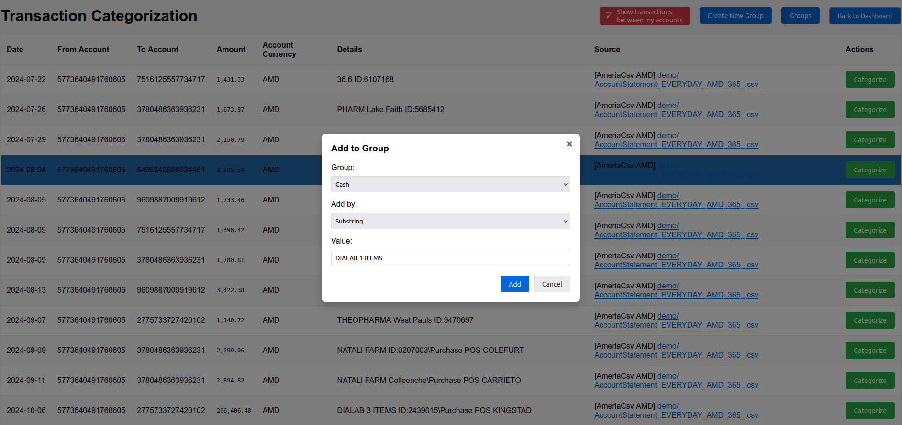

# AM BudgetView
Local tool to investigate your expenses and incomes by bank transactions.

Was renamed from [aggregate-inecobank-statement](https://github.com/AlexanderMakarov/aggregate-inecobank-statement) after new features were added.

----

To control your budget you need to know all expenses and incomes, right?
But it is too time-intensive to note all expenses and incomes manually, each day.
Fortunately banks do it for us already.
If you are using a bank plastic card or NFC application on the smartphone you probably have all your transactions written somewhere already.

For example Armenian's [Inecobank](https://online.inecobank.am)
and [Ameria Bank](https://ameriabank.am) allows to download list of all transactions in files.
They even send them in monthly emails.

So current application is a simple and completely local tool which allows to aggregate all transactions (hundreds of them) from
multiple accounts and banks into customizable groups.
Next it allows to normalize them to one currency and explore on handy charts with ability to drill-down to details.

Results are:

### 1. Browser page with aggregated information about your budget in intuitive charts:

Automatically opens browser with local UI:





### 2. Text report with most important and structured insights into your budget.

See example (numbers are made up, sum may not match):
```
Statistics for 2023-06-01..2023-06-30 (in AMD):
  Income  (total  2 groups, filtered sum 3,428,455.00):
    Salary                             : 1,935,000.00
    Unknown                            : 1,493,455.00
  Expenses (total 10 groups, filt-ed sum 1,027,553.69):
    To other account                   :   467,000.00
    Cash                               :   150,000.00
    Unknown                            :   136,575.00
    Groceries                          :   111,542.50
    Yandex Taxi                        :    59,600.00
    Health                             :    55,000.00
    Pharmacies                         :    31,684.39
    Wildberries                        :    11,110.00
    Entertainment                      :     4,800.00
    Subscriptions                      :       241.80
Statistics for 2023-07-01..2023-07-31 (in AMD):
...
```

### 3. [Beancount](https://github.com/beancount/beancount) file with app available accounting details for further exploration in [Fava UI](https://github.com/beancount/fava).


Some banks provide similar dashboards on their websites, but they can't assign good categories suitable for everyone.
This application allows you to configure categorization for your personal set of groups and completely automatically.

## List of supported banks, file formats and relevant notes

In short supported: Inecobank individual accounts (haven't tried with legal account though),
Ameriabank both individual and legal accounts.

- [FULL] Inecobank XML (.xml) files downloaded per-account from https://online.inecobank.am/vcAccount/List
  (click on account, choose dates range, icon to download in right bottom corner).
  Supports all features native to app and Beancount reports.
  In `config.yaml` is referenced by `inecobankStatementXmlFilesGlob` setting.
  Parsed by [ineco_xml_parser.go](/ineco_xml_parser.go).
- [NONE] Inecobank Excel (.xls) files downloaded per-account from https://online.inecobank.am/vcAccount/List
  (the same place as XML above) - ARE NOT SUPPORTED because XML downloaded from the same place
  is more light and predictable format for parsing.
- [PARTIAL] Inecobank Excel (.xlsx) files which Inecobank sends in emails with password protection.
  Don't have Reciever/Payer account number so resulting Beancount report won't be full.
  To allow app use such files need to unprotect them first (
  [MS Office instruction](https://support.microsoft.com/en-us/office/change-or-remove-workbook-passwords-1c17af87-25e2-4dc6-94f0-19ce21ad0b68),
  [LibreOffice instruction](https://ask.libreoffice.org/t/remove-file-password-protection/30982)).
  In `config.yaml` is referenced by `inecobankStatementXlsxFilesGlob` setting.
  Parsed by [ineco_excel_parser.go](/ineco_excel_parser.go).
- [FULL] AmeriaBank for Businesses CSV (.CSV) files downloaded per-account from
  https://online.ameriabank.am/InternetBank/MainForm.wgx, click on account -> Statement,
  chose period (for custom use "FromDate" and "To" date pickers),
  set "Show equivalent in AMD" checkbox, press "Export to CSV" icon is placed at right top corner.
  Supports all features native to app and Beancount reports.
  In `config.yaml` is referenced by `ameriaCsvFilesGlob` setting.
  Parsed by [ameria_csv_parser.go](/ameria_csv_parser.go).
- [NONE] AmeriaBank for Businesses XML (.XML) files downloaded per-account from
  https://online.ameriabank.am/InternetBank/MainForm.wgx
  (the same place as CSV above) - ARE NOT SUPPORTED
  XML files from "Transactions" tab - they don't contain own Reciever/Payer account number and currency.
- [FULL] MyAmeria Account Statements Excel (.xls) dowloaded from pages like
  https://myameria.am/cards-and-accounts/account-statement/******.
  On the web site choose Cards and Accounts -> Current account -> Statement,
  here select period (last option usually), if available the set "In AMD" (under "Show also"),
  choose "Excel" format, press "Download". Almost the same in mobile app.
  Default file name "<account_number> account statement.xls".
  Supports all features native to app and Beancount reports.
  In `config.yaml` is referenced by `myAmeriaAccountStatementXlsxFilesGlob` setting.
  Parsed by [ameria_stmt_parser.go](/ameria_stmt_parser.go).
- [PARTIAL] MyAmeria History Excel (.xls) files downloaded from https://myameria.am/events.
  Page doesn't work on the bank's web site and mobile app for now (September 2024)
  but is supported for previously downloaded reports.
  In `config.yaml` is referenced by `myAmeriaHistoryXlsFilesGlob` setting.
  Note that it should be accompanied by `myAmeriaMyAccounts` setting because files
  don't have account number or by `myAmeriaIncomeSubstrings` setting
  to at least distinguish incomes from expenses in the file.
  Parsed by [ameria_history_parser.go](/ameria_history_parser.go).

To add new bank support please provide file with transactions
(in private or with obfuscsated data, because it contains sensitive information)
downloaded from the bank application and instructions how you got this file.

# How to use

<details>
<summary>Инструкция на русском:</summary>

1. Загрузите исполняемый файл приложения (имя начинается с "am-budget-view-"), скомпилированный для вашей операционной системы со страницы
[Releases](https://github.com/AlexanderMakarov/am-budget-view/releases):
- Для Windows используйте "am-budget-view-windows-amd64.exe". Даже если у вас процессор Intel.
  Используйте версию "arm", только если у вас ARM процессор.
- Для Mac OS X с процессором M1+ используйте "am-budget-view-darwin-arm64".
  Для старых Macbook (до 2020 года) используйте "am-budget-view-darwin-amd64".
- Для большинства Linux-es выберите "am-budget-view-linux-amd64".
2. Загрузите "Statement" файлы с банковских сайтов за требуемый период и
  поместите их рядом с исполняемым файлом ("am-budget-view-...").
  Подробности см. на [List of supported banks, file formats and relevant notes](#list-of-supported-banks-file-formats-and-relevant-notes).
  Все файлы необходимо поместить в ту же папку, где находится исполняемый файл
  ("am-budget-view-..."). Детали по банкам:
  - Для индивидуальных счетов Inecobank - откройте [Online Inecobank сайт](https://online.inecobank.am)
    выберите нужный счет, укажите в полях "From" и "To" необходимый диапазон,
    нажмите "Search", проскролльте страницу вниз, найдите в правом нижнем углу
    5 значков, нажмите на значок "XML" чтобы загрузить файл.
  - Для индивидуальных счетов Ameria откройте [My Ameria сайт](https://myameria.am/),
    выберите нужный счет, выберите опцию "Statement" (справа),
    задайте необходимый диапазон, установите флажок "In AMD" (чтобы получить курсы обмена),
    выберите "Excel", нажмите "Download" чтобы загрузить файл.
  - Для юридических счетов Ameria откройте [Online Ameriabank сайт](https://online.ameriabank.am/),
    выберите "Accounts" в левом меню, выберите нужный счет,
    нажмите кнопку "Statement" вверху, в появившемся диалоговом окне задайте требуемый период,
    установите флажок "Show equivalent in AMD" (чтобы получить курсы обмена),
    нажмите "ОК", на новой вкладке "Account Statement" найдите 5 значков в правой средней части,
    нажмите на значок "Export to CSV" чтобы загрузить файл.
  - Для "INECOBANK Statement" XLSL файлов которые Inecobank присылает для
    индивидуальных счетов - 
    (учтите что эти файлы не содержат "Reciever/Payer" номера счёта поэтому часть
    функционала не будет работать и лучше использовать "Statement" файлы с сайта)
    так как XLSL файлы защищены паролем то их нужно сохранить в папку приложения
    без защиты ([MS Office instruction](https://support.microsoft.com/en-us/office/change-or-remove-workbook-passwords-1c17af87-25e2-4dc6-94f0-19ce21ad0b68),
    [LibreOffice instruction](https://ask.libreoffice.org/t/remove-file-password-protection/30982)).
3. Запустите приложение ("am-budget-view-\*-\*").
  Если все в порядке то через пару секунд откроется новая вкладка в браузере
  с агрегированными данными из банковских транзакций, которые были предоставлены через "Statement" файлы.
  В противном случае откроется текстовый файл с описанием ошибки.
  В случае ошибки необходимо ее исправить чтобы продолжить работу.
  Самая распространенная ошибка — это когда файлы банковских транзакций, загруженные на шаге № 2,
  не соответствуют `inecobankStatementXmlFilesGlob`, `inecobankStatementXlsxFilesGlob`,
  `myAmeriaAccountStatementXlsxFilesGlob`, `ameriaCsvFilesGlob`,
  `myAmeriaHistoryXlsFilesGlob`
  [шаблонам поиска glob](https://ru.wikipedia.org/wiki/%D0%A8%D0%B0%D0%B1%D0%BB%D0%BE%D0%BD_%D0%BF%D0%BE%D0%B8%D1%81%D0%BA%D0%B0)
  объявленным в файле "config.yaml" (приложение создает файл "config.yaml" при первом запуске).
  При успешном запуске страница браузера, скорее всего, будет содержать несколько
  начальных категорий и одну большую категорию "Unknown" созданную из еще не
  категоризированных транзакций.
4. Для категоризации транзакций используйте кнопку "Категоризация транзакций" в правом
  верхнем углу. Откроется страница со списком не категоризованных транзакций где
  у каждый строки справа будет кнопка "Категоризовать". При нажатии на неё откроется
  модальное окно для создания нового правила категоризации.
  Окно содержит выбор категории, способа категоризации и значения.
  Приложение поддерживает следующие способы категоризации (типы правил):
  - "Подстрока" - выбранная подстрока ищется в столбце "Пометки".
  - "Со счёта" - выбранный номер счёта ищется в столбце "Со счёта".
  - "На счёт" - выбранный номер счёта ищется в столбце "На счёт".
  После нажатия на кнопку "Добавить" новое правило категоризации будет добавлено в
  конфигурационный файл "config.yaml" и страница будет обновлена с применением нового правила.
  Таким образом большой список транзакций можно будет категоризировать достаточно быстро.
  Если нужно добавить новую категорию то используйте кнопку "Создать новую категорию"
  в правом верхнем углу.
  Если нужно удалить уже существующую категорию или посмотреть все категории и правила
  то нажмите кнопку "Категории" - откроется отдельная страница со список категорий и
  кнопкой "Удалить" для каждой из них.
5. После того, как вы классифицируете все транзакции, вы получите готовый и интуитивно
  понятный отчет о расходах и доходах, сравнения месяцев, принятия финансовых решений и т.д.
  Обратите внимание, что чем больше счетов будет предоставлено приложению,
  тем более полной будет финансовая картина.
6. С прошествием времени достаточно добавить новые или обновить старые "Statement" файлы
  с новыми транзакциями и снова запустить приложение.
  Возможно потребуется добавить новые правила категоризации для новых транзакций.
  Важно сохранять конфигурационный файл "config.yaml" чтобы не потерять Ваши
  персональные правила категоризации.
</details>

Script in English:

1. Download the application executable file (name starts with "am-budget-view-")
   compiled for your operating system from the
   [Releases](https://github.com/AlexanderMakarov/am-budget-view/releases) page:
 	- For Windows use "am-budget-view-windows-amd64.exe". Even if you have an Intel CPU. Use "arm" version only if your CPU is ARM-based.
 	- For Mac OS X with M1+ CPU/core use "am-budget-view-darwin-arm64".
   	For older Macbooks (before 2020) use "am-budget-view-darwin-amd64".
 	- For most of Linux-es choose "am-budget-view-linux-amd64".
2. Download "Statement" files from bank sites for required period and
   put them near the executable file ("am-budget-view-...").
   See details on 
   [List of supported banks, file formats and relevant notes](#list-of-supported-banks-file-formats-and-relevant-notes).
   All files need to place in the same folder where the executable file
   ("am-budget-view-...") is placed. Details per bank:
   - For Inecobank individual accounts - open [Ineco Online main page](https://online.inecobank.am),
     click on the required account, set into 'From' and 'To' fields dates you want to analyze,
     press 'Search', scroll page to bottom, at the right corner look for 5 icons,
     press XML icon to download the file.
   - For Ameria individual accounts open [My Ameria main page](https://myameria.am/),
     click on the required account, choose "Statement" option at right,
     set required period, set "In AMD" checkbox (to have exchange rates),
     select "Excel", press "Download" to download the file.
   - For Ameria legal accounts open [Ameriabank main page](https://online.ameriabank.am/),
     select "Accounts" in left menu, select on the required account,
     press "Statement" option at top, in appeared dialog set required period,
     set "Show equivalent in AMD" checkbox (to have exchange rates), press "OK",
     in new "Account Statement" tab look for 5 icons at the middle right,
     press "Export to CSV" to download the file.
   - For "INECOBANK Statement" XLSL files which Inecobank sends for
     individual accounts - 
     (note that these files don't contain "Reciever/Payer" account number
     so some functionality won't work and it's better to use "Statement" files from the site)
     since XLSL files are protected by password they need to be saved in the application folder
     without protection ([MS Office instruction](https://support.microsoft.com/en-us/office/change-or-remove-workbook-passwords-1c17af87-25e2-4dc6-94f0-19ce21ad0b68),
     [LibreOffice instruction](https://ask.libreoffice.org/t/remove-file-password-protection/30982)).
3. Run application ("am-budget-view-\*-\*" file).
   If everything is OK then after a couple of seconds it would open a new tab in browser
   with aggregated details from bank transactions which where provided via "Statement" files.
   Otherwise it would open a text file with the error description.
   In case of an error it is required to fix it to proceed.
   Most common error is when bank transactions files downloaded on #2 step
   doesn't match `inecobankStatementXmlFilesGlob`, `inecobankStatementXlsxFilesGlob`,
   `myAmeriaAccountStatementXlsxFilesGlob`, `ameriaCsvFilesGlob`,
   `myAmeriaHistoryXlsFilesGlob`
   [glob file patterns](https://en.wikipedia.org/wiki/Glob_(programming))
   declared in "config.yaml" file (app would create default "config.yaml" file near it).
   But in a successful case browser page most probably would contain some pre-defined groups
   and one big "Unknown" group made from all uncategorized yet transactions.
4. To categorize transactions use "Transaction Categorization" button at the top right.
   It would open a page with a list of uncategorized transactions where each row would have
   a "Categorize" button on the right. When pressed it would open a modal window for creating
   a new categorization rule.
   This window contains group (category) selection, rule type and value.
   Application supports the following categorization types (rule types):
   - "Substring" - selected substring is searched in "Details" column.
   - "From Account" - selected account number is searched in "From Account" column.
   - "To Account" - selected account number is searched in "To Account" column.
   After pressing "Add" button new categorization rule would be added to
   "config.yaml" file and page would be updated with new rule applied.
   So a big list of transactions could be categorized quickly.
   If you need to add a new category use "Create New Group" button at the top right.
   If you need to delete an existing category or see all categories and rules
   then press "Groups" button - it would open a separate page with a list of groups
   (categories) and a "Delete" button for each of them.
5. After you categorize all transactions you would get a ready and intuitive report
   about expenses and incomes, comparison of months, making financial decisions and so on.
   Note that more statement files are provided to the application, the more full financial
   picture would be.
6. With time it is enough to add new or update old "Statement" files with new transactions
   and run application again.
   It may be required to add new categorization rules for new transactions.
   It is important to save "config.yaml" file to not lose your personal categorization rules.

### Notes:
1. For remained formats and banks steps are near the same as for Inecobank.
2. Files which banks are sending in emails not always have all required information.
3. It is a command line application and may work completely in the terminal.
   Run it with `-h` for details.
   It would explain how to work with multiple configuration files and see information directly in terminal.
4. Application automatically starts in "local HTTP server mode" and opens in a default browser.
5. Application supports 3 "reporting" modes: 'web' - default, 'file' - to open text report in default TXT files veiwer,
   'none' - only STDOUT.
6. Application supports one more "categorization" mode - need to set `categorizeMode: true` in configuration file.
   This mode is useful to find transactions without categories.

# Use with Beancount and Fava UI

Application by-default generates [Beancount](https://github.com/beancount/beancount) file
which then may be used with [Fava UI](https://github.com/beancount/fava).
Beancount report contains more data than usual TXT report, it allows to do full double-entry accounting.
Fava UI is local and free accounting tool which allow to see these reports.
But it also hard to understand for those who don't have solid accounting knowledge,
so consider to use built-in HTML UI instead.

To install Fava UI (built with Python) run something like `pip3 install fava`.

After getting log like `Built Beancount file 'AM Budget View.beancount' with 1818 transactions.`
from am-budget-view run in the same folder `fava AM\ Budget\ View.beancount` - it should print
`Starting Fava on http://127.0.0.1:5000`. Open this link in browser and it would show
graphs and other accounting visualization, financial statistic about your transactions.
If run am-budget-view one more time (for example with corrected configuration) then
Fava UI would catch up changes without restart (need press button on page).

# Limitations

- Application does not have currencies exchange rates source other than transactions files you provide to it.
  But it allows to perform conversions even using those scarse information from transaction files.
  It converts currencies with direct exchange rates first, next with best multi-hop conversion option
  found by Dijkstra algorithm. Precision is measured as a number of days between current day and each
  exchange rate date used for conversion hop, with one exception - even if target date is the same date
  where we have direct exchange rate then precision would be 1, because precision 0 means "no conversion",
  i.e. transaction currency is a target currency.
- Application does not support a way to categorize transactions in a different way for different accounts.

# Contributions

Feel free to contribute your features, fixes and so on.

It is usual Go repo with some useful shortcuts in [Makefile](/Makefile).

Also please help to fix Armenian subtitles in the [YouTube video](https://www.youtube.com/embed/4MZN-SK15HE?cc_load_policy=1) - I believe that Google Translator provided
me with pretty mediocre translation but my Armenian knowledge is not enough to make subtitles better.

# Development

## Setup

- Install Go v1.21+
- `go mod init`
- Made your changes, run test via [Makefile](/Makefile) targets and test manually with `go run .`
- Make PR.

## Release
Merge to "master", next push tag with name "releaseX.X.X" and some comment to put into release log.
CI will do the rest.

## TODO/Roadmap

- [x] Fail if wrong field in config found.
- [x] Add CI for pull requests (different branches).
- [x] Parse CSV-s from online.ameriabank.am.
- [x] Propagate not fatal errors from parsing files into report.
- [x] Parse XLS-s from myameria.am.
- [x] Parse InecoBank XLS files which are sent in emails and
      InecoBank doesn't allow to download data older than 2 years.
- [x] Rename repo to don't be tied to Inecobank.
- [x] Build translator to https://github.com/beancount/beancount
      Check in https://fava.pythonanywhere.com/example-beancount-file/editor/#
- [x] Add currencies support in UI.
- [x] Provide rates conversion precision in UI and other reports.
- [x] Add drill-down page to see individual journal entries.
- [x] Solve double counting of transactions between own accounts.
- [x] Enhance errors when no transaction files found.
- [x] Make default config.yaml on first run if not found.
- [x] Translate to Russian.
- [x] Avoid situation when port is binded by previous app instance.
- [x] Write instruction about both options for Ameriabank transactions.
- [x] Enable categorization by accounts, like "expense to this account is a rent".
- [x] Add "Categorization" page in UI and relevant functionality.
- [ ] Support group to ignore some transactions as "to me". Because:
      a) user may have transactions from other bank accounts.
      b) transaction between banks may happen under different account.
- [ ] Add "Edit" actions to "Groups" page (to revert wrong change).
- [ ] Collect more details about accounts (distribution of usage?), separate page.
- [ ] Manage all settings (config.yaml) in web UI, separate page.
- [ ] Record new video(s) with instructions.
- [ ] Add good demo data, write instruciton how to use it (speed up releases and build trust in app).
- [ ] Fix folders structure, see https://appliedgo.com/blog/go-project-layout
- [ ] (? small value) Add translation to all parsers and set right Russian declensions.
- [ ] (? value vs complexity) Allow to choose "transactions" files in UI.
- [ ] (? small value) Improve translation to Russian with correct declensions everywhere.
- [ ] (? unclear value) Add multi-currency support: call https://open.er-api.com/v6/latest/AMD
- [ ] (? impossible) Support different schemas with parsing. Aka "parse anything".
- [ ] (? not enough feedback) Improve tests coverage.
- [ ] ~~Build UI with Fyne and https://github.com/wcharczuk/go-chart
      (https://github.com/Jacalz/sparta/commit/f9927d8b502e388bda1ab21b3028693b939e9eb2).~~
      There are issue with [performance and charts flexibility](https://github.com/fyne-io/fyne/issues/2228) this way.
